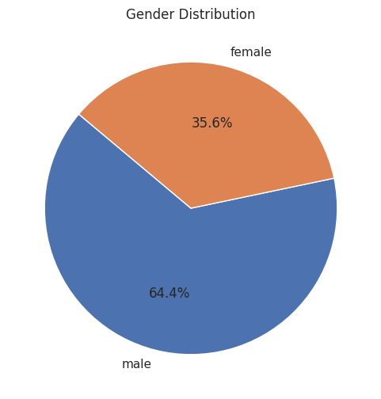

# Agent Workflow

The Agent Workflow is the core functionality of the `tablegpt-agent`. It processes user input and generates appropriate responses. This workflow is similar to those found in most single-agent systems and consists of an agent and various tools. Specifically, the data analysis workflow includes:

- **An Agent Powered by TableGPT2**: This agent performs data analysis tasks. It is designed to understand and execute complex data analysis queries, providing accurate and insightful results.
- **An IPython tool**: This tool executes the generated code within a sandbox environment, ensuring that the code runs safely and efficiently.

Additionally, TableGPT Agent offers several optional plugins that extend the agent's functionality:

- **Visual Language Model**: This plugin can be used to enhance summarization for data visualization tasks.
- **Retriever**: This plugin fetches information about the dataset, improving the quality and relevance of the generated code.
- **Safety Mechanism**: This plugin protects the system from toxic inputs.

## Workflow Steps

1. **User Input**: The user provides a query or command to the agent.
2. **Security Assessment (optional)**: The agent evaluates whether the user's query involves sensitive topics. If it does, the agent will prompt the LLM to be cautious in its response.
3. **Data Retrieval(optional)**: The retriever plugin fetches relevant data and metadata.
4. **Code Generation**: The agent generates the appropriate code to perform the requested task.
5. **Code Execution**: The generated code is executed in the IPython sandbox environment.
6. **Result Generation**: The agent processes the results of the code execution and generates a response.
7. **Visual analysis (optional)**: Perform visual analysis and summary on the generated pictures to enrich the answers.

**NOTE:** During the operation of `tablegpt-agent`, the system will repeatedly attempt to resolve any issues that arise during code execution. As a result, Steps `4~7` may be executed multiple times in an iterative debugging process. This cycle continues until the final solution is reached or the maximum iteration limit is exceeded. The default maximum iteration count is **25**.

## Example Workflow

### User Input

The user inputs a query:

> Draw a pie chart of the male-female ratio based on gender.

### Security Assessment (Optional)

When creating a `tablegpt-agent`, you can specify a dedicated safety evaluation model using the `safety_llm` parameter. For example:

```python
from langchain_openai import ChatOpenAI
from tablegpt.agent import create_tablegpt_graph

safety_llm = ChatOpenAI(openai_api_base="LLM_URL", openai_api_key="whatever", model_name="LLM_MODEL_NAME")

agent = create_tablegpt_graph(
    ...
    safety_llm=safety_llm,
    ...
)
```

If `safety_llm` is configured, it will evaluate user inputs to identify if they fall under any of the following `14` hazard categories. If a question is flagged as belonging to one of these categories, `tablegpt-agent` will respond with caution.

| Hazard Category | Description |
| ---- | ---- |
| S1: Violent Crimes | Violent criminal activities |
| S2: Non-Violent Crimes | Non-violent criminal activities |
| S3: Sex-Related Crimes | Crimes related to sexual misconduct |
| S4: Child Sexual Exploitation | Exploitation of children |
| S5: Defamation | Defamatory content |
| S6: Specialized Advice | Professional advice (e.g., medical, legal) |
| S7: Privacy | Privacy violations |
| S8: Intellectual Property | Intellectual property issues |
| S9: Indiscriminate Weapons | Use or production of indiscriminate weapons |
| S10: Hate | Hateful or discriminatory content |
| S11: Suicide & Self-Harm | Suicide or self-harm-related content |
| S12: Sexual Content | Explicit sexual content |
| S13: Elections | Content related to elections |
| S14: Code Interpreter Abuse | Misuse of code interpretation features |

This feature enhances the safety of the `tablegpt-agent`, helping to mitigate ethical and legal risks associated with generated content.

### Data Retrieval (optional)

The retriever plugin recalls columns and values related to the query, enhancing the LLM's understanding of the dataset. This improves the accuracy of the code generated by the LLM. For detailed usage instructions, refer to [Enhance TableGPT Agent with RAG](../../howto/retrieval).

For this example, based on the user’s input, the retrieved results are as follows:

```pycon
Here are some extra column information that might help you understand the dataset:\n- titanic.csv:\n  - {"column": Sex, "dtype": "string", "values": ["male", "female", ...]}
```

### Code Generation
The agent generates the following Python code:
```python
import seaborn as sns
import matplotlib.pyplot as plt

# Count the number of males and females
gender_counts = df1['Sex'].value_counts()

# Create a pie chart
plt.figure(figsize=(6, 6))
plt.pie(gender_counts, labels=gender_counts.index, autopct='%1.1f%%', startangle=140)
plt.title('Gender Distribution')
plt.show()
```

### Code Execution

The generated code is automatically executed in the IPython sandbox environment.

### Result Generation

After the execution is complete, the results are generated as follows:



### Visual Analysis (optional)

The visual analysis plugin allows you to enhance generated results with visualizations, making the output more intuitive and informative.

To enable this feature, you can pass the `vlm` parameter when creating a `tablegpt-agent`. Here’s an example:

```python
from langchain_openai import ChatOpenAI
from tablegpt.agent import create_tablegpt_graph

vlm = ChatOpenAI(openai_api_base="VLM_URL", openai_api_key="whatever", model_name="VLM_MODEL_NAME")

agent = create_tablegpt_graph(
    ...
    vlm=vlm,
    ...
)
```

Once enabled, the `tablegpt-agent` will use the `vlm` model to generate visual representations of the data.  

For instance, in response to the query mentioned earlier, the `tablegpt-agent` generates the following visualization:

> *I have drawn a pie chart illustrating the ratio of men to women. From the chart, you can see that men constitute 64.4% while women make up 35.6%. If you need any further analysis or visualizations, feel free to let me know.*  

This feature adds a layer of clarity and insight, helping users interpret the results more effectively. On some complex graphs, this function is more effective.
